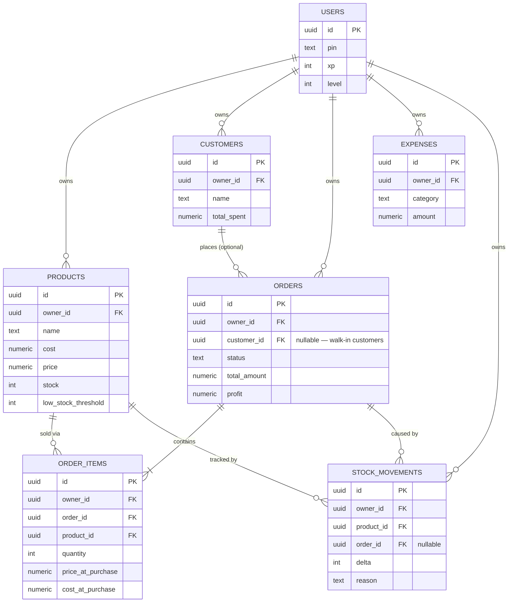

# SwiftSell Data Model

This documents how SwiftSell's data actually links together, and — just as
important — **which operations must go through a database function instead
of a plain client-side update.** The stock/customer-total corruption bug
(Aug 2026) happened because order creation and cancellation were done as
separate client-side "read the current value, compute a new value, write it
back" calls. That pattern is unsafe: it can read a stale number, and it
gives no guarantee that a partial failure won't leave data half-updated.
The fix moves those operations into the database as single atomic
transactions. Anything that touches `products.stock` or
`customers.total_spent` should go through the functions below — never a
direct `update` from the client.

## Entity relationship diagram

## Key relationships, in plain terms

- **Everything is owned by exactly one user** (`owner_id`), enforced by
  Row Level Security — no cross-account data leakage is possible even if
  the client had a bug.
- **An order optionally links to a customer.** `customer_id` is nullable
  for walk-in sales. When it's set, the customer's `total_spent` must stay
  in sync with their non-cancelled orders — see below.
- **An order's real content lives in `order_items`**, not on the order row
  itself. This is what makes cancellation correct: restoring stock reads
  *this order's own items*, never an ambient "current stock" value.
- **`stock_movements` is an append-only audit ledger.** Every stock change
  is logged with a reason and (when applicable) the order that caused it.
  If stock ever looks wrong again, query this table first — it's the
  source of truth for "why is stock what it is."

## The two functions that must be used for order lifecycle

### `create_order_with_items(p_customer_id, p_notes, p_items)`

1. Locks and validates every product row **before** writing anything —
   rejects the order outright if `quantity > stock` for any line item
   (this is the fix for the "ordering 100 when only 20 exist" bug).
2. Computes `total_amount` / `profit` from the product's *current*
   price/cost — the client never sends pre-computed totals.
3. Inserts the order + order_items, decrements stock with an atomic
   `stock = stock - quantity` (never a client-computed absolute value),
   and logs a `stock_movements` row per item.
4. If a customer is attached, increments their `total_spent`.

All in one Postgres transaction — either the whole thing succeeds, or
none of it applies.

### `cancel_order(p_order_id)`

1. Refuses to run twice on the same order, and refuses to cancel an
   already-`delivered` order.
2. Restores stock **from that order's own `order_items` rows** — this is
   the actual fix for the reported bug, since it never depends on
   whatever the product's current stock happens to read.
3. Logs the restoration to `stock_movements`.
4. Reverses the customer's `total_spent` (floored at 0).
5. Sets the order's status to `cancelled`.

## Verification (Aug 2026)

Tested directly against the live database before shipping:
- A test product at stock=20: ordering 100 was rejected, stock stayed 20.
- Ordering 15 correctly dropped stock to 5.
- Cancelling that order restored stock to exactly 20 (not a corrupted
  number derived from the order quantity).
- Cancelling the same order twice was correctly rejected.
- `stock_movements` showed the exact -15 / +15 pair, net zero.

Existing data repaired: `customers.total_spent` was recalculated from real
order history (it had been stuck at 0 for every customer, since nothing
had ever written to it). Historical stock levels on the 3 real products
were **not** guess-corrected, since there's no way to know their true
original values — verify those manually via the Inventory edit form.
